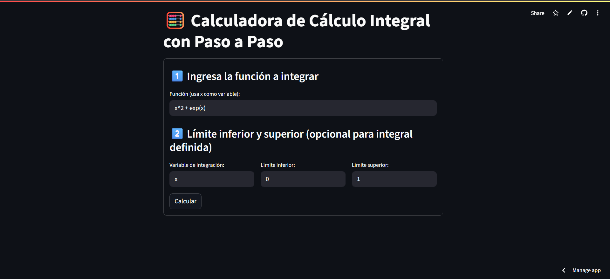
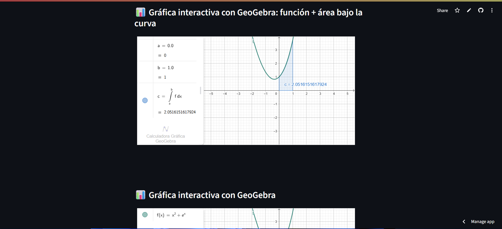

# 🧮 Calculadora de Cálculo Integral con Paso a Paso

Este proyecto es una aplicación interactiva creada con **Streamlit** que permite a los usuarios calcular integrales definidas e indefinidas **paso a paso**, visualizando además la función y el área bajo la curva mediante **GeoGebra** embebido.
## [👉PROBAR LA CALCULADORA DE CALCAULO](https://github.com/JHAMILCALI)

## 🚀 Funcionalidades

- Entrada de una función simbólica (por ejemplo: `x^2 + exp(x)`).
- Integración indefinida simbólica paso a paso con `SymPy`.
- Cálculo de la integral definida entre dos límites personalizados.
- Visualización matemática con `LaTeX`.
- Gráfica interactiva de la función y el área bajo la curva usando GeoGebra.
- Soporte para diferentes variables de integración.

## 📦 Requisitos

Asegúrate de tener **Python 3.10+**. El proyecto fue probado con Python `3.13.5`.

Instala las dependencias necesarias desde el archivo `requirements.txt`:

```bash
pip install -r requirements.txt
```
Contenido del requirements.txt:
```bash
sympy
matplotlib
numpy
streamlit
```
## ▶️ Ejecución

Activa tu entorno virtual (si no tienes uno, créalo con python -m venv venv):
```bash
.\venv\Scripts\Activate.ps1  # En Windows
source venv/bin/activate  # En Linux/macOS
```
Luego ejecuta la app con:
```bash
streamlit run app.py
```
## 📸 Capturas de Pantalla
Entrada

Resultado paso a paso

Gráfica interactiva

## 🛠️ Tecnologías utilizadas
```
SymPy

GeoGebra Embed

NumPy
```
